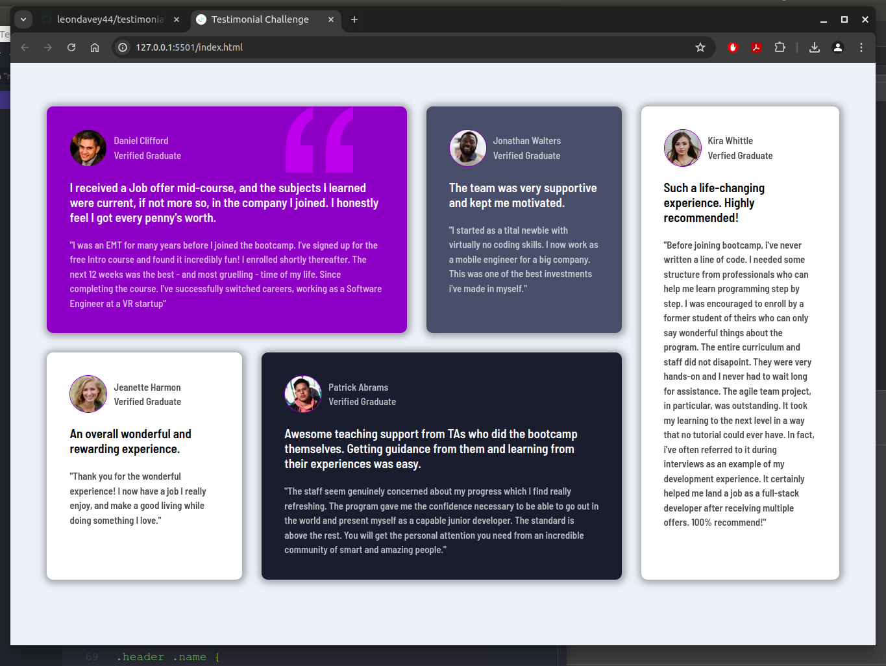

# Frontend Mentor - Testimonials grid section solution

This is a solution to the [Testimonials grid section challenge on Frontend Mentor](https://www.frontendmentor.io/challenges/testimonials-grid-section-Nnw6J7Un7). Frontend Mentor challenges help you improve your coding skills by building realistic projects.

## Table of contents

- [Overview](#overview)
  - [The challenge](#the-challenge)
  - [Screenshot](#screenshot)
  - [Links](#links)
- [My process](#my-process)
  - [Built with](#built-with)
  - [What I learned](#what-i-learned)
  - [Continued development](#continued-development)
  - [Useful resources](#useful-resources)

## Overview

### The challenge

Users should be able to:

- View the optimal layout for the site depending on their device's screen size

### Screenshot

## My process

To follow the brief as accurately as possible!

### Built with

- Semantic HTML5 markup
- CSS custom properties
- Flexbox
- Mobile-first workflow

### What I learned

I have learned the benefits of flexbox for designing an optimal layout for mobile devices, so the layout will adjust depending on the users screen size.

<h2>
  If you are interested in seeing what CSS I have used in this challenge see my style.css file in Github.
</h2>

### Continued development

This was a short project to grasp flexbox a little deeper before moving onto my next project. My aim was to focus on learning more about flexbox before learning CSS Grid. My next project will most likely be CSS Grid focused but will also include flexbox too - after this I have my eyes set on learning Angular!

### Useful resources

- [Front End Mentor](https://www.frontendmentor.io/challenges/testimonials-grid-section-Nnw6J7Un7/hub) - This is where I found the project brief for the challenge. Great website and I will use it going forward.
